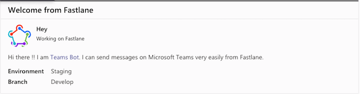

# Microsoft Teams Bot `fastlane` plugin

[](https://rubygems.org/gems/fastlane-plugin-teams_bot)
[](https://badge.fury.io/rb/fastlane-plugin-teams_bot)


## Getting Started

This project is a [_fastlane_](https://github.com/fastlane/fastlane) plugin. To get started with `fastlane-plugin-teams_bot`, add it to your project by running:

```bash
fastlane add_plugin teams_bot
```

## About teams_bot

With this plugin you will be able to send a message on a microsoft teams channel.

Beforehand you must create a new incoming webhook on the Microsoft Teams channel of your choice, you can follow this documentation to help you do this: [Incoming Webhook](https://docs.microsoft.com/en-US/microsoftteams/platform/webhooks-and-connectors/how-to/add-incoming-webhook#add-an-incoming-webhook-to-a-teams-channel)

`teams_bot` allows you to send a fully custom message to a specific incoming webhook.

## Usage

```ruby
teams_bot(
    teams_url: "<incoming webhook URL",
    title: "Welcome from Fastlane",
    text: "Hi there !! I am [Teams Bot](https://github.com/huextrat/fastlane-plugin-teams_bot). I can send messages on Microsoft Teams very easily from Fastlane.",
    activity_title: "Hey",
    activity_image: "https://seeklogo.com/images/F/fastlane-logo-6CA0B0B428-seeklogo.com.png"
)
```

or

```ruby
teams_bot(
    teams_url: "<incoming webhook URL",
    title: "Welcome from Fastlane",
    text: "Hi there !! I am [Teams Bot](https://github.com/huextrat/fastlane-plugin-teams_bot). I can send messages on Microsoft Teams very easily from Fastlane.",
    activity_title: "Hey",
    activity_image: "https://seeklogo.com/images/F/fastlane-logo-6CA0B0B428-seeklogo.com.png",
    facts: [
        {
            "name" => "Environment",
            "value" => "Staging"
        },
        {
            "name" => "Branch",
            "value" => "Develop"
        }
    ],
    theme_color: "321244", # A custom RGB color
    use_markdown: true # Using markdown allowing you to add URL in your text
)
```

This code give the following message:



### Help

Once installed, information and help for an action can be printed out with this command:

```bash
fastlane action teams_bot
```

### `teams_bot`

| Key               | Description                | Env Var                    | Default |
|-------------------|----------------------------|----------------------------|---------|
| theme_color       | Theme color of the message card | TEAMS_MESSAGE_THEME_COLOR  | 321244  |
| title             | The title that should be displayed on Teams | TEAMS_MESSAGE_TITLE        |         |
| summary           | The summary that should be displayed on Teams | TEAMS_MESSAGE_SUMMARY      | summary |
| activity_title    | A summary of your message  | TEAMS_MESSAGE_ACTIVITY_TITLE  |         |
| activity_subtitle | A quick subtitle for your activity (date, project name, branch, ...)  | TEAMS_MESSAGE_ACTIVITY_SUBTITLE  | ''      |
| activity_image    | Display an image on your activity (project logo, company logo, ...)  | TEAMS_MESSAGE_ACTIVITY_IMAGE  |         |
| text              | The message you want to display    | TEAMS_MESSAGE_TEXT         |         |
| use_markdown      | Define to use or not markdown       | TEAMS_MESSAGE_USE_MARKDOWN  | true    |
| facts             | Optional facts (assigned to, due date, status, branch, environment, ...)   | TEAMS_MESSAGE_FACTS        | []      |
| teams_url         | The URL of the incoming Webhook you created on your Microsoft Teams channel   | TEAMS_MESSAGE_TEAMS_URL    |         |

## Example

Check out the [example `Fastfile`](fastlane/Fastfile) to see how to use this plugin. Try it by cloning the repo, running `fastlane install_plugins` and `bundle exec fastlane test`.

## Issues and Feedback

For any other issues and feedback about this plugin, please submit it to this repository.

## Troubleshooting

If you have trouble using plugins, check out the [Plugins Troubleshooting](https://docs.fastlane.tools/plugins/plugins-troubleshooting/) guide.

## Using _fastlane_ Plugins

For more information about how the `fastlane` plugin system works, check out the [Plugins documentation](https://docs.fastlane.tools/plugins/create-plugin/).

## About _fastlane_

_fastlane_ is the easiest way to automate beta deployments and releases for your iOS and Android apps. To learn more, check out [fastlane.tools](https://fastlane.tools).
